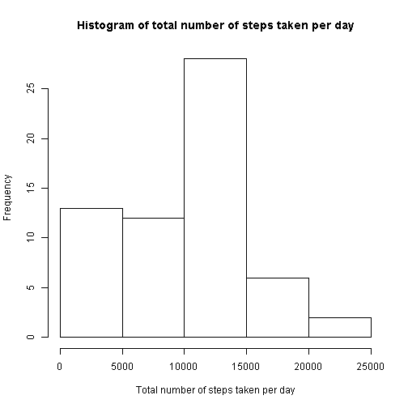
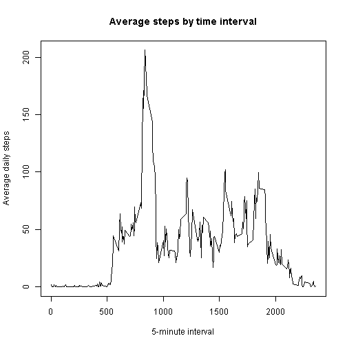
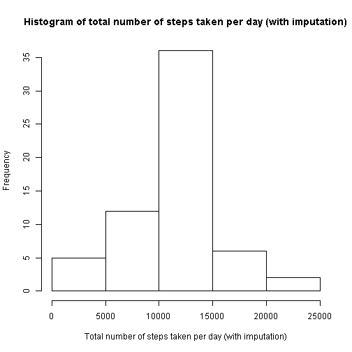

## Loading and preprocessing the data

The data is downloaded into a local folder if required, and then read into a
data-frame using the read.csv() routine.  

The date column is transformed into values of type "Date" to make it easier
to work with.


```r
furl <- "https://d396qusza40orc.cloudfront.net/repdata%2Fdata%2Factivity.zip"
if (! file.exists("activity.csv")) {
    if (! file.exists("activity.zip")) {
        
        download.file(furl, destfile = "activity.zip")
    }
    unzip("activity.zip")
}
dat <- read.csv("activity.csv")
dat$date <- as.Date(dat$date, "%Y-%m-%d")
```

## What is mean total number of steps taken per day?

The data is first grouped by date and the total number of steps for each date
is computed (missing values are ignored here).  

The mean and median values of the total number of steps per day are then
computed and saved for later reporting. A histogram over the per-day total
step count is also plotted.


```r
spd <- tapply(dat$steps, dat$date, sum, na.rm = TRUE)
meanspd <- mean(spd)
medspd <- median(spd)
hist(spd, main = "Histogram of total number of steps taken per day",
     xlab = "Total number of steps taken per day")
```

 

Based on the above computations, the mean and median of the total number of
steps taken per day are as follows:  

Mean: 9354  

Median: 10395

## What is the average daily activity pattern?

For examining the average daily activity pattern, the data is first grouped by
5-minute intervals. Each group contains the step counts for a specific
interval, over all days for which measurements have been conducted.  

For each interval, the average step count is then computed over all the days
for which measurements are available (missing values are ignored here).  

The interval corresponding to the maximum average step count is then
determined and saved for later reporting. A line-plot of the average step
count vs. the 5-minute intervals is also plotted.


```r
library(dplyr)
```

```
## Warning: package 'dplyr' was built under R version 3.2.3
```

```
## 
## Attaching package: 'dplyr'
## 
## The following objects are masked from 'package:stats':
## 
##     filter, lag
## 
## The following objects are masked from 'package:base':
## 
##     intersect, setdiff, setequal, union
```

```r
gbi <- group_by(dat, interval)
aspi <- summarize(gbi, avg_steps = mean(steps, na.rm = TRUE))
maxstepint <- aspi$interval[which.max(aspi$avg_steps)]
plot(aspi$interval, aspi$avg_steps, type="l",
     main = "Average steps by time interval",
     xlab = "5-minute interval", ylab = "Average daily steps")
```

 

Based on the above computations, the 5-minute interval which corresponds to the
maximum step count averaged over all days turns out to be minute 835
to minute 840.

## Imputing missing values

The step count values are missing for some entries in the original data. For
every row with a missing step count value, we attempt to fill in the missing
value with the average step count for the 5-minute interval corresponding to
that row. Note that the average step counts for all the 5-minute intervals
have already been computed previously, and we can reuse that data here.  

Once the missing values have been filled in, we then re-compute the total
step count for each day and then plot a histogram over this data.


```r
mvc <- sum(is.na(dat$steps))
dat_imp <- merge(dat, aspi, by.x = "interval", by.y = "interval")
dat_imp$imputed_steps <- apply(dat_imp, 1, function(x) {
    if (is.na(x["steps"]))
        as.numeric(x["avg_steps"])
    else
        as.numeric(x["steps"])
})
ispd <- tapply(dat_imp$imputed_steps, dat_imp$date, sum)
meanispd <- mean(ispd)
medispd <- median(ispd)
hist(ispd,
     main="Histogram of total number of steps taken per day (with imputation)",
     xlab="Total number of steps taken per day (with imputation)")
```

 

Based on the above computations, the number of rows in the original data with
missing values turns out to be 2304.  

Above, we have also re-computed the mean and median of the total number of
steps taken per day after the missing values have been filled in. These new
values are as follows:  
Mean: 10766  
Median: 10766  

Interestingly, the new mean and median turn out to be very closely aligned
after imputation of missing values. The new values also deviate a bit from the
original ones, with the mean deviating much more than the median. In relative
terms (when compared to the original values), the deviations are as follows:  
New mean: 15.0943396%
deviation from original value.  
New median: 3.5708387%
deviation from original value.

## Are there differences in activity patterns between weekdays and weekends?

For comparing activity patterns between weekdays and weekends, the imputed
data-set is enhanced with an additional column containing a 2-level factor
value which indicates whether the relevant row has a date value corresponding
to a weekday or a weekend.  

This enhanced data-set is then grouped over a combination of the interval and
weekday/weekend columns, and the average step count is computed for each group.
Thus, for every 5-minute interval, we get two average step counts for that
interval: one for weekdays and one for weekends.  

Finally, a time-series plot is constructed for average step count vs.
5-minute interval, with separate panels for weekday and weekend data. A
comparison of the plots within these two panels enables us to compare the
activity patterns between weekdays and weekends.


```r
library(lattice)
dat_imp$datetype <- sapply(dat_imp$date, function (x) {
    wd <- weekdays(x)
    if (wd %in% c("Saturday", "Sunday"))
        "weekend"
    else
        "weekday"
})
dat_imp$datetype <- as.factor(dat_imp$datetype)
gbiw <- group_by(dat_imp, interval, datetype)
aspiw <- summarize(gbiw, avg_steps = mean(imputed_steps))
xyplot(avg_steps ~ interval | datetype, data = aspiw, layout = c(1,2),
       type="l", xlab = "Interval", ylab = "Number of steps")
```

 
